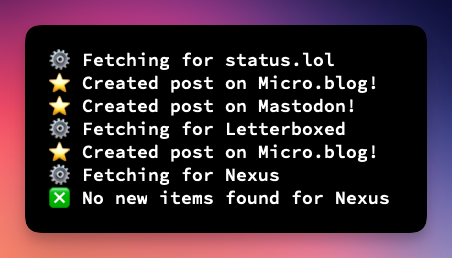

# Echo - RSS to Micro.blog



## What is it?

Echo is a node script to post new items from an RSS feed to Micro.blog.

### Why "Echo"?

It does RSS feeds, so Feeder. Feeder are a band with an album called Echo Park. Echo is a good name because the album link AND the meaning of the word echo. So there.

### Micro.blog already does that you fool

You're right and it does an excellent job of it but sometimes I want a bit more control over exactly how things are posted, for example:

- I want to set a category on imported posts (e.g. status.lol posts tagged as "status")
- For Letterboxd, I don't want to include the movie poster in my posts

## Requirements

- Node 19 (it might work with earlier versions but that's what I used)
- A server/computer/potato to run it on

## Usage

1. Clone this repository
2. Run `npm install` to install the node module
3. Run `cp config.example.js config.js` to create a new config file
4. [Grab an API key from Micro.blog](https://micro.blog/account/apps) and paste it in the config file under `apiKey`
5. Put your Micro.blog site url in the config (e.g. if your username is `wrigglyjim` enter `https://wrigglyjim.micro.blog`)
6. Add your feeds (see below for options)
7. Run `node index.js init` to setup - this will store the latest ID so only new posts going forward will be posted. If you want to post _some_ items from a feed, add the ID of the latest item you don't want to post in `data/nameofsite.txt`.
8. Setup a cron to run `node index.js` regularly

🚨 **Warning**: If you don't run `node index.js init` first, the script will post **all** the posts in the RSS feeds. You _probably_ don't want this.

You can also run `node index.js dry` - this will log which posts will be created, but _will not_ post anything.

Echo keeps track of the last item posted so on subsequent runs it will only post new posts.

### Configuration

A site has four attribute:

- `name` (required): this can be anything (this is used in a filename so probably don't use special characters).
- `feed` (required): the feed URL you want to post to Micro.blog (e.g. <https://mycoolsite.com/feed>).
- `categories` (optional): An array of categories to assign to you posts for the site (e.g. `["Cat One", "Cat Two"]`).
- `transform` : this is an object with two functions (see below for preset transforms):
  - `getId`: This tells Echo which attribute to use for the ID of each feed item. Most feeds use `id` or `guid` but if it's something different you can set that here.
  - `format`: This is how you format the title, body, and date of the post. This returns an object with content, date, and an optional title.
  - `filter` (optional): Use this if you need to filter out specific items in a feed. For example, Letterboxd includes items for lists being updated which I don't want to be posted.

#### Example Configuration

```js
{
    name: "example.com",
    feed: "http://example.com/feed",
    categories: ["my category"],
    transform: {
        getId: (data) => {
            return data.id
        },
        format: (data) => {
            return {
                content: data.content,
                date: data.isoDate,
                title: data.title, // optional
            }
        },
        filter: (items) => {
            return items.filter(item => {
                return !item.link.includes('/list/')
            })
        }
    }
}
```

### Preset Transforms

Echo has a few presets you can use instead of having to write the `getId` and `format` functions for every site. These can be seen in [`presets.js`](presets.js). For example, to use the Letterboxd or status.lol preset you can do the following:

```js
{
    name: "letterboxd.com",
    feed: "http://letterboxd.com/exampleuser/rss",
    categories: ["movies"],
    transform: presets.letterboxd,
},
{
    name: "status.lol",
    feed: "http://exampleuser.status.lol/feed",
    categories: ["status"],
    transform: presets.statuslol,
}
```

You can define the body of your post in `format` to make your posts look exactly how you want. For ease, Echo includes `helpers.js` with common formatters (well, one right now). To convert HTML to markdown, use `helpers.toMarkdown`:

```js
format: (data) => {
    const formatted = presets.letterboxdNoPoster.format(data)
    formatted.content = helpers.toMarkdown(formatted.content)
    return formatted
}
```
